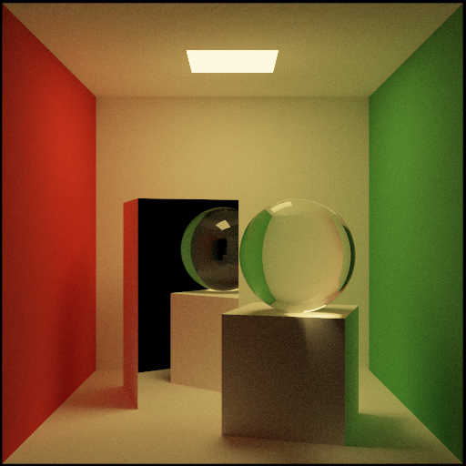
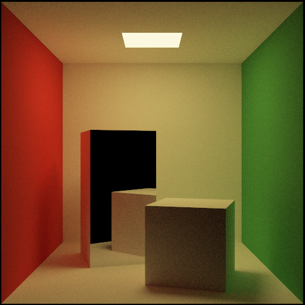
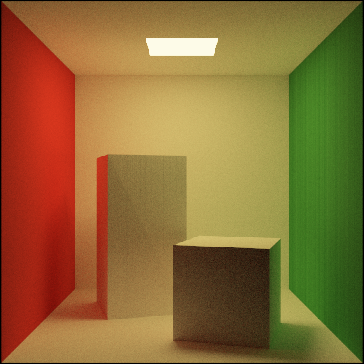
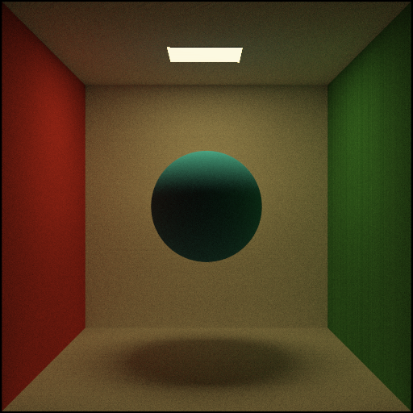
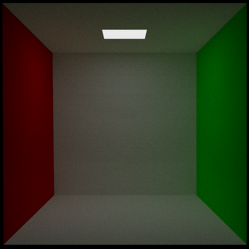

# Ronald

Path tracing rendering engine in C++20

## Building / Testing / Running

```bash
# Release build
make release
./build/ronald --help

# Debug build
make debug

# Build and run unit tests
make test
```

Basic Feature Set

- [x] CLI parsing
- [x] PPM image generation
- [x] Vec3 class implementation
- [x] Ray/Sphere intersection calculation
- [x] Ray/Triangle intersection
- [x] Diffuse material scatter function
- [x] Light source material
- [x] Dielectric material
- [x] Recursive tracing function
- [x] Realistic camera model with aperture and field of view
- [x] Single threaded render loop
- [x] Clamp to [0, 1] tone mapping
- [x] Scene description using JSON/JSONC config file

Extended Feature Set (Not considered MVP or required for final submission)

- [x] Axis-aligned bounding box class
- [x] Bounding Volume Hierarchy [1]
- [x] Multithreaded render loop
- [x] Reinhard Tone Mapping
- [x] Reflective/semi-reflective material, including shallow-angle reflection and total
      internal reflection
- [x] Russian Roulette path termination

[1] BVH is implemented but currently has poor (but still correct) performance when used
in a multi-threaded context. I have not had the time to profile the app and determine the
cause of the performance degradation, and since the BVH was outside of the project MVP
from the beginning I am going to leave it as-is.

## Progress Updates

### 2022-06-21 -- Resolved Dielectric material artifact errors

There was a long-standing error with Dielectric materials caused by setting `T_MIN` too
low in the `hit_objects` function. After hours of rummaging around in the code the bug
was located and fixed. Now the program can render nice looking glass materials.

| Config      | Value          |
| ----------- | -------------- |
| Resolution  | 512x512        |
| Samples     | 10000          |
| Threads     | 10             |
| TMO         | Reinhard Jodie |
| Render Time | 18m57s         |
| Commit      | a9d5e33f       |



### 2022-06-15 -- Implemented Russian Roulette Path Termination

A description of Russian Roulette termination can be found in the `/resources` folder.
I've also included comments in the relevant portion of code. The final image looks
identical, but notice that the render time has gone down from 33 minutes to just 20
minutes. This is a huge savings for just a few extra lines of code.

| Config      | Value          |
| ----------- | -------------- |
| Resolution  | 512x512        |
| Samples     | 10000          |
| Threads     | 10             |
| TMO         | Reinhard Jodie |
| Render Time | 20m07s         |
| Commit      | 153672b8       |



### 2022-06-15 -- Resolved vertical line artifacts

A longer description of the fix is included in the commit message. This commit marks the
completion of the "MVP" portion of the project. I think at this point the project is
probably in a "submittable" state and would receive a good grade.

| Config      | Value          |
| ----------- | -------------- |
| Resolution  | 512x512        |
| Samples     | 10000          |
| Threads     | 10             |
| TMO         | Reinhard Jodie |
| Render Time | 33m40s         |
| Commit      | 5c31f121       |


### 2022-06-14 -- Added full Cornell Box Scene

Added the full Cornell Box scene geometry based on the specification from their website.
There is still a persisting bug where the renderer produces "vertical line" artifacts
(look closely at the green wall). The boxes themselves also aren't completely
perpendicular to the floor so there is some weird shading on the front of the taller box

| Config      | Value          |
| ----------- | -------------- |
| Resolution  | 512x512        |
| Samples     | 10000          |
| Threads     | 10             |
| TMO         | Reinhard Jodie |
| Render Time | 51m36s         |
| Commit      | 61cd6ee5       |



### 2022-06-14 -- Implemented multi-threaded rendering

| Config      | Value          |
| ----------- | -------------- |
| Resolution  | 512x512        |
| Samples     | 7000           |
| Threads     | 10             |
| TMO         | Reinhard Jodie |
| Render Time | 14m56s         |
| Commit      | b9d00140       |



### 2022-06-12 -- Successfully rendered the Cornell Box exterior

| Config      | Value          |
| ----------- | -------------- |
| Resolution  | 512x512        |
| Samples     | 7000           |
| Threads     | 1              |
| TMO         | Reinhard Jodie |
| Render Time | 5h6m57s        |
| Commit      | b6bbaab5       |


